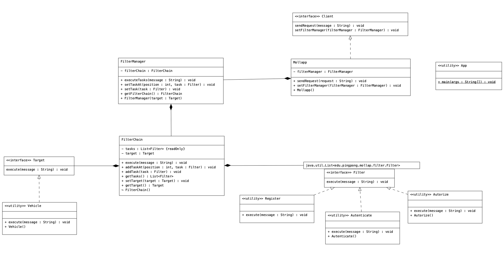

# Furnace-DIP Kata

Kata to practice the "intercepting filter" design pattern, a small app simulating a Registration, Authentication and Authorization process on a client (Client) that wants to access a vehicle (Target).
Going through a process of executing tasks (FilterChain) executed by a task manager (FilterManager).

UML Diagram of the code:

